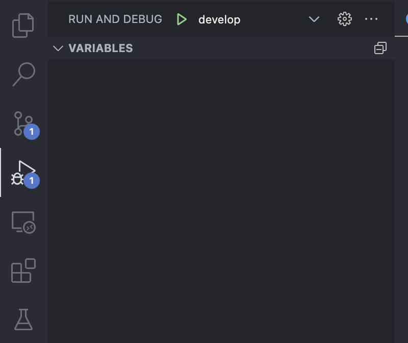

# Mobile App

## Download Apps
Berikut ini link untuk download apps Pokemon Card dev dan production [link](https://drive.google.com/drive/folders/1YV7DZqnIAosjL_9dlBvnIKadm6YlS-Xf?usp=sharing)

## Getting Started Debugging
1. Download dan Install flutter dengan mengikuti flow di web berikut [https://docs.flutter.dev/get-started/install](https://docs.flutter.dev/get-started/install).
2. Setelah melakukan proses instalasi cek di terminal/command prompt menggunakan command `flutter doctor -v`. 
3. Jika semua parameter hasil `flutter doctor -v` sudah ter "centang" seperti ini  Jalankan command `flutter pub get` di repo ini.
4. Jalankan build runner dengan command `sh runner.sh` untuk men-generate beberapa blok code. Pastikan proses ini berhasil dijalankan.
5. Coba run project menggunakan emulator/physical device yang terhubung dengan command `sh debug_dev.sh` untuk environment development dan `sh debug_prod.sh` untuk environment production.
6. atau jika menggunakan vs code dapat menggunakan button debug seperti pada gambar berikut 

## Getting Started Release App (Android)
1. Persiapkan keystore, untuk membuat keystore dapat mengikuti beberapa cara di link berikut [ini](https://stackoverflow.com/questions/3997748/how-can-i-create-a-keystore),
2. Saya menggunakan command berikut `keytool -genkey -v -keystore upload.keystore -alias upload_alias -keyalg RSA -keysize 2048 -validity 10000`
3. Setelah mendapatkan keystore pindahkan file ke dalam folder [android/app](android/app/upload.keystore)
4. buat file *key.properties* di dalam folder [android]() dengan content seperti berikut: 
5. Untuk test release aplikasi dapat menggunakan command `sh run_release_dev.sh` atau `run_release_prod.sh`.

## Getting Started Unit Test

1. Jalankan command `flutter pub get` di repo ini.
2. Jalankan build runner dengan command `sh runner.sh` untuk men-generate beberapa blok code. Pastikan proses ini berhasil dijalankan.
3. jalankan command `flutter test test/cards_bloc_test.dart` di terminal untuk mengetahui hasil unit test.